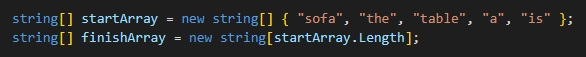
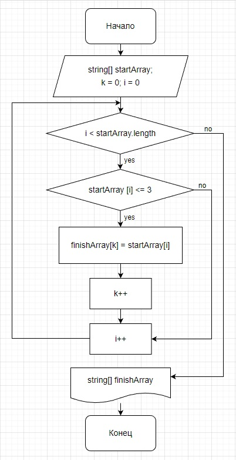
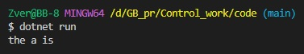

# Описание проекта

## Задаем массивы
Задаем массив строк, который необходимо отсортировать. Создаем пустой массив.

## Сортируем массив

Массыв строк сортируется при помощи метода, который исключает строки содержащие более трех символов и записывает их в пустой массив.

## Вывод результата

На завершающем этапе написания кода, выводим на экран массив с отсортированными строками.

